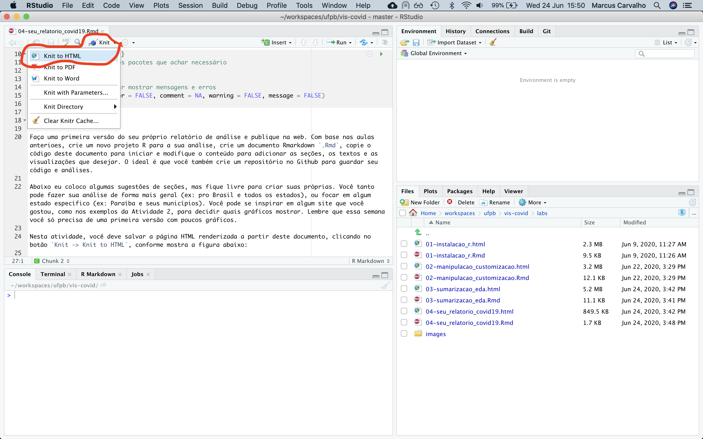
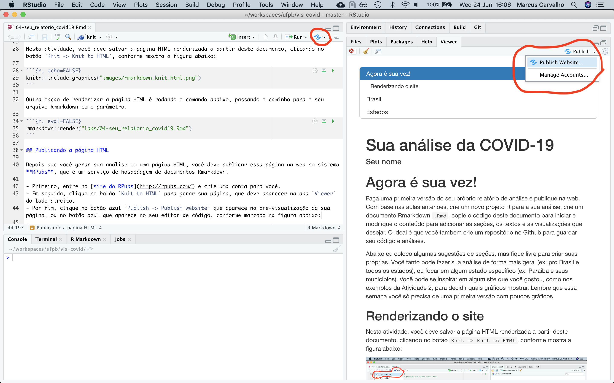

```{r setup, include=FALSE}
# instale e adicione outros pacotes que achar necessário
library(tidyverse)

# configurações para evitar mostrar mensagens e erros
knitr::opts_chunk$set(error = FALSE, comment = NA, warning = FALSE, message = FALSE)
```

# Descrição da atividade

Faça uma primeira versão do seu próprio relatório de análise e publique na web. Com base nas aulas anteriores, crie um novo projeto R para a sua análise, crie um documento Rmarkdown `.Rmd`, copie o código deste documento para iniciar e modifique o conteúdo para adicionar as seções, os textos e as visualizações que desejar. O ideal é que você também crie um repositório no Github para guardar seu código e análises.

Abaixo eu coloco algumas sugestões de seções, mas fique livre para criar suas próprias. Você tanto pode fazer sua análise de forma mais geral (ex: pro Brasil e todos os estados), ou focar em algum estado específico (ex: Paraíba e seus municípios). Você pode se inspirar em algum site que você gostou, como nos exemplos da Atividade 2, para decidir quais gráficos mostrar. Lembre que essa semana você só precisa de uma primeira versão com poucos gráficos.

## Renderizando a página HTML

Nesta atividade, você deve salvar a página HTML renderizada a partir deste documento, clicando no botão `Knit -> Knit to HTML`, conforme mostra a figura abaixo:

```{r, echo=FALSE}

```

Outra opção de renderizar a página HTML é rodando o comando abaixo, passando o caminho para o seu arquivo Rmarkdown como parâmetro:

```{r, eval=FALSE}
rmarkdown::render("labs/04-seu_relatorio_covid19.Rmd")
```

## Publicando a página HTML

Depois que você gerar sua análise em uma página HTML, você deve publicar essa página na web no sistema **RPubs**, que é um serviço de hospedagem de documentos Rmarkdown.

- Primeiro, entre no [site do RPubs](http://rpubs.com/) e crie uma conta para você.
- Em seguida, clique no botão `Knit to HTML` para gerar sua página, que deve aparecer na aba `Viewer` do lado direito.
- Por fim, clique no botão azul `Publish -> Publish website` que aparece na pré-visualização da sua página, ou no botão azul que aparece no seu editor de código, conforme marcado na figura abaixo:

```{r, echo=FALSE}

```

## Envio da atividade

Siga as instruções e publique sua página de análise na conta que você criou no RPubs. Ao finalizar a postagem, a página que você criou deve abrir na sua conta do RPubs.

Você deve enviar através da atividade do Google Classroom:

- O arquivo `.Rmd` com a sua análise inicial
- O arquivo `.html`com a página gerada

Além disso, você deve postar como um comentário nesta atividade, para toda a turma, o link para a página com a sua análise publicada no RPubs.


## Material extra

Links sobre Rmarkdown:

- [Ciência de dados com R. Capítulo 11 - Rmarkdown](https://cdr.ibpad.com.br/rmarkdown.html)
- [Documentação do Rmarkdown](https://rmarkdown.rstudio.com/lesson-1.html)

Recomendo fortemente ver os documentos que eu uso para gerar o material das aulas e dos labs. Eles são feitos em Rmarkdown e estão disponíveis aqui: https://github.com/analise-de-dados-ufpb/vis-covid/tree/master/labs


# Agora é a sua vez!

Edite este documento Rmarkdown para criar suas análises. Você pode apagar as instruções acima.

Abaixo eu coloco algumas sugestões de seções, mas fique livre para criar suas próprias. Você tanto pode fazer sua análise de forma mais geral (ex: pro Brasil e todos os estados), ou focar em algum estado específico (ex: Paraíba e seus municípios). Você pode se inspirar em algum site que você gostou, como nos exemplos da Atividade 2, para decidir quais gráficos mostrar.

Lembre-se que essa semana você só precisa de uma primeira versão com poucos gráficos. Você pode começar com o básico, com a evolução dos casos e óbitos ao longo do tempo, como já foi demonstrado nas aulas anteriores.


## Brasil

Aqui você pode colocar análises e visualizações agregados para todo o Brasil.

### Casos no Brasil

### Óbitos no Brasil


## Estados

Aqui você pode colocar análises e visualizações comparando os estados.

### Casos nos estados

### Óbitos nos estados

