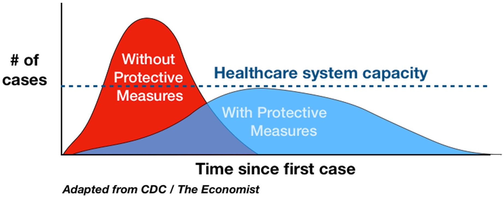
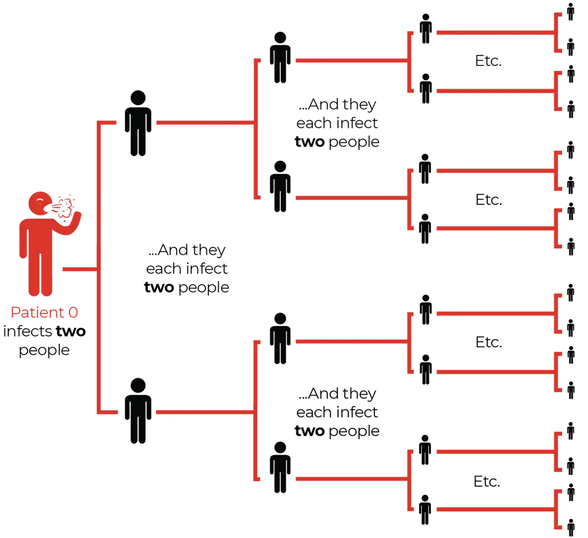
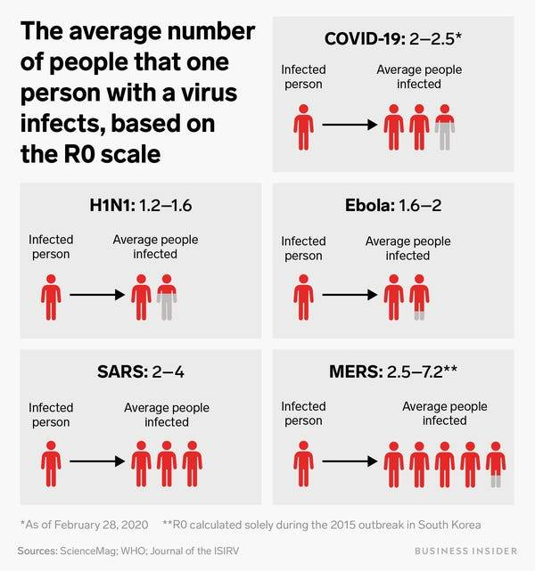
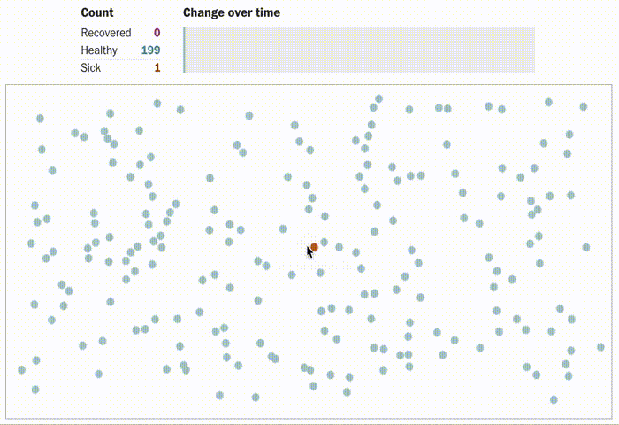
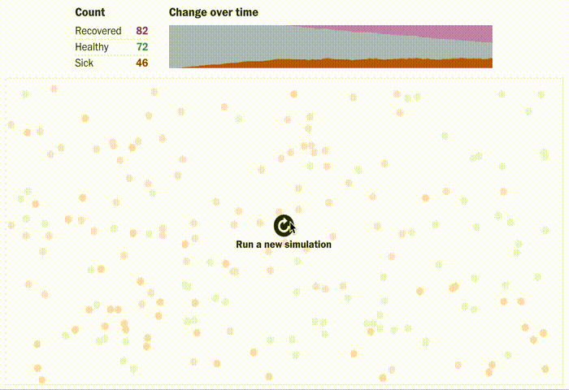
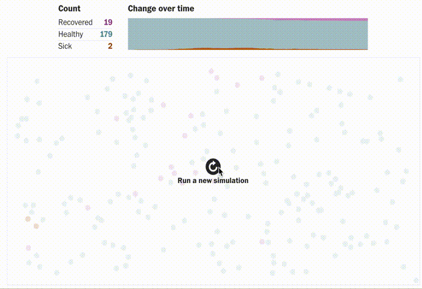
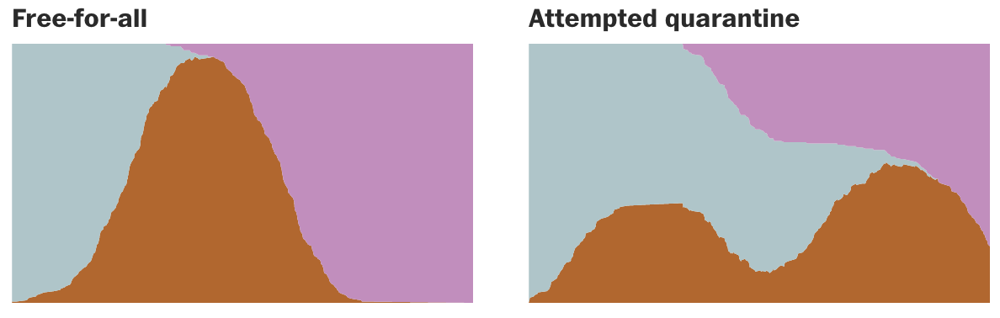
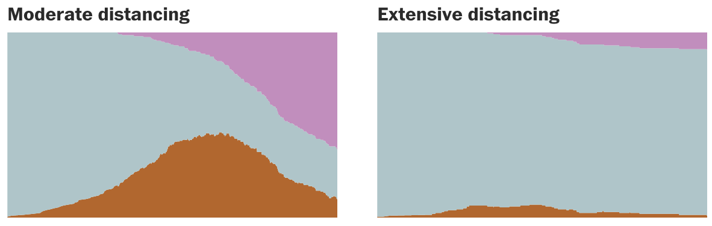
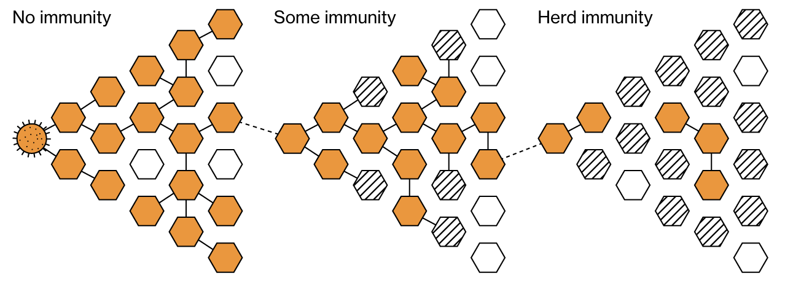

```{r setup, include=FALSE}
library(dplyr)
library(emo)
library(knitr)
library(ggplot2)
library(lubridate)
library(patchwork)
library(stringr)

theme_set(theme_bw())
knitr::opts_chunk$set(echo = FALSE, message = FALSE, warning = FALSE)
```

<style>
div.footnotes {
  position: absolute;
  bottom: 0;
  margin-bottom: 10px;
  width: 80%;
  font-size: 0.6em;
}
</style>

# Qual a visualização mais famosa sobre a COVID-19?

## _Flatten the curve!_ (achate a curva) { .build }

```{r, out.width = "800px", fig.align="center"}

```

**Mensagem**

- <span class="red">Sem medidas protetivas</span> a capacidade do sistema de saúde é ultrapassada
- <span class="blue">Medidas protetivas</span> podem evitar o colapso do sistema de saúde

# Por que os casos de COVID-19 crescem tão rápido?

## Número básico de reprodução ($R_0$)

- Cada pessoa infectada pode infectar em média outras _X_ pessoas

<div class="columns-2">

```{r, out.width = "500px"}

```

- Exemplo: $R_0 = 2$

> - Se a cada dia um infectado transmite para outras 2 pessoas
> - Pessoas infectadas depois de:
>     - 1 semana: $~2^7 ~~= 128$
>     - 2 semanas: $2^{14} = 16.384$
>     - 3 semanas: $2^{21} = 2.097.152$
>     - 4 semanas: $2^{28} = 268.435.456$
> - **<span class="red">Crescimento exponencial!</span>**
>     - $f(t) = a * b^t$

</div>$

## Exemplos de $R_0$ para algumas doenças

<div class="columns-2">
```{r, out.width = "500px"}

```
</div>

## Exemplos de $R_0$ para algumas doenças

<div class="columns-2">

```{r, out.width = "500px"}

```

```{r, fig.width=5, fig.height=2}
x <- 1:7
dados <- tibble(R0 = 2, x, y = 2^x) %>%
  bind_rows(tibble(R0 = 1.5, x, y = 1.5^x)) %>%
  bind_rows(tibble(R0 = 1, x, y = x)) %>%
  mutate(R0 = factor(R0))

p1 <- ggplot(dados, aes(x, y, col = R0)) +
  geom_line() +
  ggtitle("Casos ao longo do tempo") +
  theme(axis.title = element_blank())
p1
```
</div>

## Exemplos de $R_0$ para algumas doenças

<div class="columns-2">

```{r, out.width = "500px"}

```

```{r, fig.width=5, fig.height=2}
p2 <- ggplot(dados, aes(x, y, fill = R0)) +
  geom_col() +
  facet_wrap(~ paste("R0 =", R0), scales = "free_y") +
  theme(legend.position = "none", axis.title = element_blank()) +
  ggtitle("Com escalas diferentes para o eixo y")

p1
p2
```

</div>

## Número efetivo de reprodução $R_e$

<span class="red">O crescimento é tão assustador assim? Dobra a cada dia e não para de crescer?</span>

> - $R_0$ é um valor **teórico** que mede o potencial de transmissão da doença
> - Na prática:
>     - Pessoas já infectadas podem se tornar resistentes
>     - Podem ser adotadas medidas protetivas (quarentena, máscaras, ...)
> - $R_e$ indica o número **efetivo** de reprodução, quando nem todos são suscetíveis


## Simulação da transmissão no tempo

- Evolução dos <span style="color:#538B94">Saudáveis</span>, <span style="color:#9F4C00">Infectados</span> e <span style="color:#96418A">Recuperados</span> <span style="font-size: 0.6em">([Washington Post - Corona Simulator](https://www.washingtonpost.com/graphics/2020/world/corona-simulator/))</span>

```{r, fig.align="center", out.width="71%"}

```


## Simulação da transmissão no tempo

- Sem medidas protetivas <span style="font-size: 0.6em">([Washington Post - Corona Simulator](https://www.washingtonpost.com/graphics/2020/world/corona-simulator/))</span>

<video src="https://www.visgraf.impa.br/coronaviz/wp-content/uploads/2020/05/wp3.mp4" controls></video>


## Simulação da transmissão no tempo

- Com quarentena temporária em um local afetado <span style="font-size: 0.6em">([Washington Post - Corona Simulator](https://www.washingtonpost.com/graphics/2020/world/corona-simulator/))</span>

<video src="https://www.visgraf.impa.br/coronaviz/wp-content/uploads/2020/05/wp4.mp4" controls></video>


## Simulação da transmissão no tempo

- Com distanciamento social moderado <span style="font-size: 0.6em">([Washington Post - Corona Simulator](https://www.washingtonpost.com/graphics/2020/world/corona-simulator/))</span>

```{r, fig.align="center"}

```

## Simulação da transmissão no tempo

- Com distanciamento social extensivo <span style="font-size: 0.6em">([Washington Post - Corona Simulator](https://www.washingtonpost.com/graphics/2020/world/corona-simulator/))</span>

```{r, fig.align="center"}

```

## Simulação da transmissão no tempo

- Resumo da evolução de <span style="color:#538B94">Saudáveis</span>, <span style="color:#9F4C00">Infectados</span> e <span style="color:#96418A">Recuperados</span> para cada medida preventiva <span style="font-size: 0.7em">(Fonte: [Washington Post - Corona Simulator](https://www.washingtonpost.com/graphics/2020/world/corona-simulator/))</span>

```{r, fig.align="center"}


```

# Afinal, quando isso acaba?

## Quando acaba?

- **Imunidade de rebanho**: porcentagem significativa se infecta e fica imunizada
  - Assume que uma pessoa não é infectada duas vezes pelo mesmo vírus
  
```{r, fig.align="center"}

```

> - Para a COVID-19, estima-se que $\approx 70\%$ da população teria que se infectar
>     - No Brasil, seriam mais de 140 milhões de infectados. <span class="red">É viável?</span>

> - Tem outra forma de imunizar tanta gente? **<span class="blue">Vacina!</span>** `r emo::ji("syringe")`

<div class="footnotes">Fonte: [Bloomberg - When and how does the coronavirus pandemic end](https://www.bloomberg.com/news/articles/2020-04-03/when-and-how-does-the-coronavirus-pandemic-end-quicktake)</div>

# Como está a evolução da COVID-19 no Brasil?

## Casos acumulados no Brasil

> - Estamos melhorando a curva, ou estamos cada vez pior?
>     - <span class="red">Curva acumulada nunca diminui (no melhor caso, estabiliza)</span> `r emo::ji("scared")`

```{r}
covid_br <- read.csv("../data/covid-br-ms-country.csv") %>%
  mutate(data = ymd(data))

p1 <- ggplot(covid_br, aes(x = data, y = casosAcumulado)) +
  geom_line() +
  ggtitle("Casos acumulados") +
  theme(axis.title = element_blank())

p1
```


## Casos novos por dia no Brasil

> - Curva de casos novos é menos acentuada e em algum momento vai cair</span> `r emo::ji("pray")`
>     - <span style="color:orange">Sobe e desce muito por dia!</span>

```{r}
ggplot(covid_br, aes(x = data, y = casosNovos)) +
  geom_line() +
  ggtitle("Casos novos") +
  theme(axis.title = element_blank())
```

## Casos novos por dia no Brasil

- Curva de casos novos é menos acentuada e em algum momento vai cair</span> `r emo::ji("pray")`
  - <span style="color:orange">Sobe e desce muito por dia!</span> <span class="blue">Mas podemos suavizar para ver tendência</span>

```{r}
p2 <- ggplot(covid_br, aes(x = data, y = casosNovos)) +
  geom_line() +
  geom_smooth(se = FALSE) +
  ggtitle("Casos novos") +
  theme(axis.title = element_blank())

p2
```

## Número efetivo de reprodução $R_e$ no Brasil

- Observamos uma tendência de queda no $R_e$ `r emo::ji("raised_hands")`
  - Último valor estimado: <span class="blue">$R_e = 1.1$</span>. Projeção futura: <span class="red">$R_e = 1$</span>

```{r}
brasil_rt <- read.csv("../data/rt_global.csv") %>%
  filter(country == "Brazil") %>%
  mutate(date = ymd(date))

p3 <- ggplot(brasil_rt, aes(date, median, col = type)) +
  geom_hline(aes(yintercept = 1), lty = "dashed") +
  geom_line() +
  coord_cartesian(ylim = c(0, 2)) +
  ggtitle("Número efetivo de reprodução") +
  theme(axis.title = element_blank(), legend.title = element_blank())

p3
```

## Afinal, qual a visualização mais adequada? {.build}

```{r, fig.width=10, fig.height=2.1}
p1 + p2 + p3
```
<div class="columns-2">
- Depende do seu objetivo!

### **<span class="blue">Ciência de dados**</span> - Habilidades:

- Ciência da computação
- Matemática e estatística
- **<span class="red">Conhecimento do domínio da aplicação</span>**

```{r, fig.align="center"}
include_graphics("images/data_science_vd.png")
```
</div>

<div class="footnotes">Fonte: [CSE 519: Data Science - Steven Skiena](http://www3.cs.stonybrook.edu/~skiena/data-manual/lectures/pdf/L1.pdf)</div>

# Antes de analisar, visualizar, modelar, prever...<br/><br/> <span class="yellow">Entenda do problema!</span>