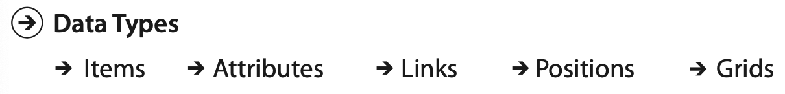
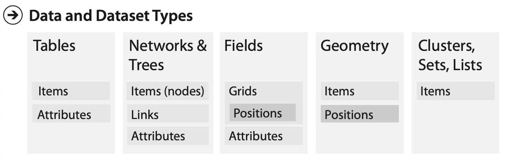
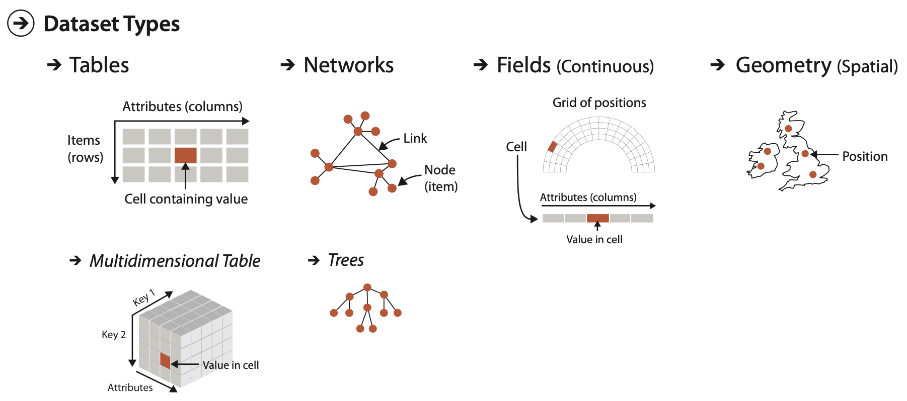
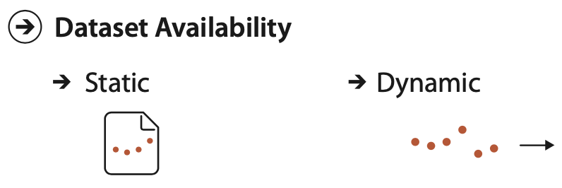
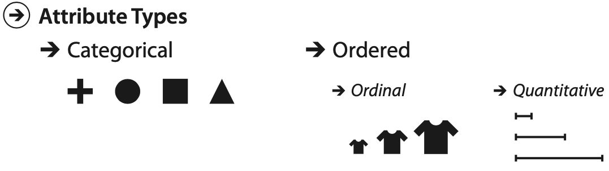
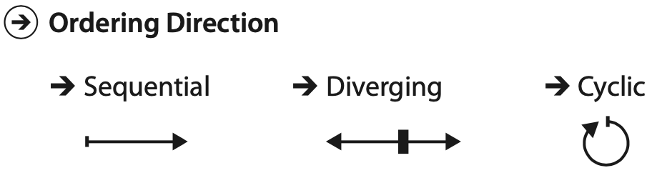

```{r setup, include=FALSE}
library(dplyr)
library(emo)
library(here)
library(knitr)
library(ggplot2)
library(lubridate)
library(patchwork)
library(stringr)

theme_set(theme_bw())
knitr::opts_chunk$set(echo = FALSE, message = FALSE, warning = FALSE)
```

<style>
div.footnotes {
  position: absolute;
  bottom: 0;
  margin-bottom: 10px;
  width: 80%;
  font-size: 0.6em;
}
</style>

## O que visualizar?

Visualizações dependem dos dados que temos à disposição

- Que tipo de dados nós temos?
- Que informações podemos extrair dos dados?
  - E quais devem ser fornecidas explicitamente?
- Quais conceitos de alto nível permitirá separmos os dados mais úteis?

O que os valores abaixo significam?

> - <span class="red">Precisamos de informações da **semântica** e dos **tipos** dos dados</span>

```{r}
covid_cities <- read.csv(here("data", "covid-br-ms-cities.csv"))
  
covid_pb <- covid_cities %>%
  filter(estado == "PB", municipio == "João Pessoa") %>%
  arrange(data) %>%
  select(estado, municipio, codmun, data, casosNovos) %>%
  mutate(difCasosNovos = casosNovos - lag(casosNovos))

covid_pb %>%
  rename(X1 = estado, X2 = municipio, X3 = codmun, X4 = data, X5 = casosNovos,
         X6 = difCasosNovos) %>%
  tail(1) %>%
  kable(row.names = FALSE)
```

## Semântica do dado {.build}

É o seu significado no mundo real

- Os nomes das colunas ajudam no significado
  - Fica mais de entender os dados assim?

```{r}
covid_pb %>%
  tail(1) %>%
  kable(row.names = FALSE)
```

<br/>

- **Metadados** podem ser fornecidos para mais informações sobre os dados
  - Dados sobre dados!

## Tipos de dados

É a sua interpretação estrutural ou matemática

**Exemplos**:

> - Se um número representa a contagem de novos casos da COVID-19 em um município, então o seu tipo é uma _quantidade_ e a soma de dois números deste tipo faz sentido

> - Se um número representa o código do IBGE de um município, o seu tipo é um _código_, que é apenas uma categoria representada por um número


## Tipos de dados

```{r}

```

> - **Atributo**: propriedade específica que pode ser medida ou observada
>     - Ex: casos, óbitos, leitos ocupados, internações
> - **Item**: entidade individual discreta, como linhas em tabela ou nó em rede
>      - Ex: municípios, hospitais, pacientes
> - **Link**: relacionamento entre itens, tipicamente em uma rede
> - **Grid**: estratégia para amostra de dados em termos geométricos e topológicos
> - **Posição**: dados espaciais, com localização espaço 2D ou 3D
>      - Ex: latitude, longitude e altitude

<div class="footnotes">Fonte:  Tamara Munzner. [**Visualization Analysis & Design**](https://www.cs.ubc.ca/~tmm/vadbook/).</div>


## Tipos de dataset (1/2)

**Dataset**: coleção de informações alvo de análises. Combina tipos de dados:

```{r}

```

> - **Tabela**: _linhas_ representam itens e _colunas_ atributos. _célula_ combina linha e coluna e contém _valor_
> - **Rede**: _nodes_ representam itens e _links_ o relacionamento entre eles
> - **Field**: _células_ com medições no domínio contínuo (valores infinitos), comuns em dados espaciais

<div class="footnotes">Fonte:  Tamara Munzner. [**Visualization Analysis & Design**](https://www.cs.ubc.ca/~tmm/vadbook/).</div>

## Tipos de dataset (2/2)

**Dataset**: coleção de informações alvo de análises. Combina tipos de dados:

```{r}

```

- **Geometria**: informações do _formato_ de itens com posições espaciais explícitas (ponto, linha, área)

> - Outras combinações: **set** (conjunto) é um grupo de itens sem ordem; **list** é um grupo ordenado; e **cluster** é um agrupamento baseado na similaridade de atributos

<div class="footnotes">Fonte:  Tamara Munzner. [**Visualization Analysis & Design**](https://www.cs.ubc.ca/~tmm/vadbook/).</div>

## Tipos de dataset

```{r}

```

<div class="footnotes">Fonte:  Tamara Munzner. [**Visualization Analysis & Design**](https://www.cs.ubc.ca/~tmm/vadbook/).</div>


## Disponibilidade do dataset

```{r}

```

- **Estático**: o dataset está disponível todo de uma vez

- **Dinâmico**: a informação do dataset vai sendo disponibilizada em fluxos dinâmicos ao longo da visualização
  - Exemplos de mudanças dinâmicas:
    - adicionar novos itens ou remover anteriores
    - alterar valores de itens existentes

<div class="footnotes">Fonte:  Tamara Munzner. [**Visualization Analysis & Design**](https://www.cs.ubc.ca/~tmm/vadbook/).</div>


## Tipos de atributos

```{r}

```

> - **Categórico** (nominal): dados não têm ordenação explícita. Ex: frutas, nomes
>     - Só consegue distinguir se coisas são iguais ou diferentes
  
> - **Ordenado**: dados têm ordenação implícita. Pode ser subdividido em:
>     - **Ordinal**: possui ordem, mas operações aritméticas não fazem sentido
>         - Ex:  _Rankings_ e tamanhos "pequeno", "médio", grande
>     - **Quantitativo**: medição que suporta comparação aritmética
>          - Números inteiros e reais, como: altura, idade, temperatura, preço

<div class="footnotes">Fonte:  Tamara Munzner. [**Visualization Analysis & Design**](https://www.cs.ubc.ca/~tmm/vadbook/).</div>


## Dados ordenados -- direção da ordenação

```{r}

```

- **Sequencial**: quando há uma faixa homogênea do valor mínimo ao máximo
  - Ex: novos casos de uma doença, que vai de zero até um valor máximo
- **Divergente**: duas sequências em direções opostas se juntam no ponto zero
  - Ex: diferença percentual de novos casos, que tem valores positivos quando cresce,  negativos quando diminui e o zero é o ponto de junção
- **Cíclico**: ao invés de crescer indefinidamente, valores retornam ao ponto inicial
  - Ex: hora do dia, dia da semana, mês do ano


## Atributos hierárquicos

- Pode existir uma estrutura hierárquica entre um ou vários atributos

> - **Exemplo 1**: atributo geográfico de uma localização
>     - Pode ser agregado no nível de bairro, cidade, estado, região ou país

> - **Exemplo 2**: quantidade de vendas de produtos online no tempo
>     - Pode ser agregado em vendas por hora, dia, mês, ano
>     - Série temporal que pode ter padrões interessantes nos diferentes níveis


## Quizz

- Qual o tipo deste dataset?
- Quais os tipos dos atributos? (categóricos, ordinais ou quantitativos)
- Qual a direção da ordenação, se aplicável? (sequencial, divergente ou cíclico)
- Quais atributos são hierárquicos? Quais as agregações possíveis?

```{r}
covid_pb %>%
  tail(4) %>%
  kable(row.names = FALSE)
```