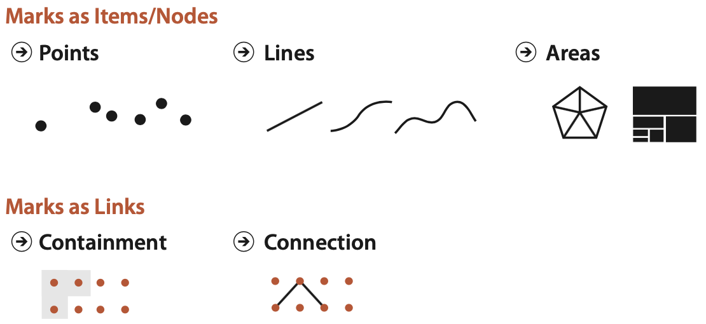
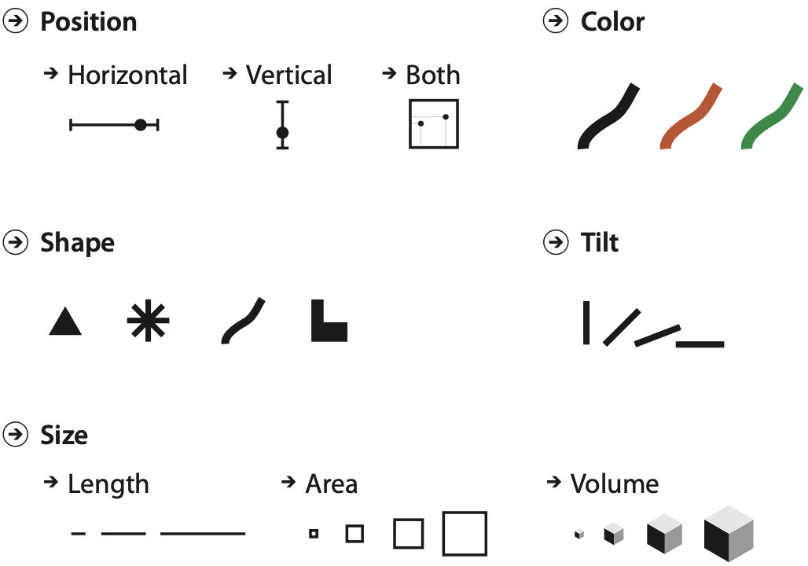
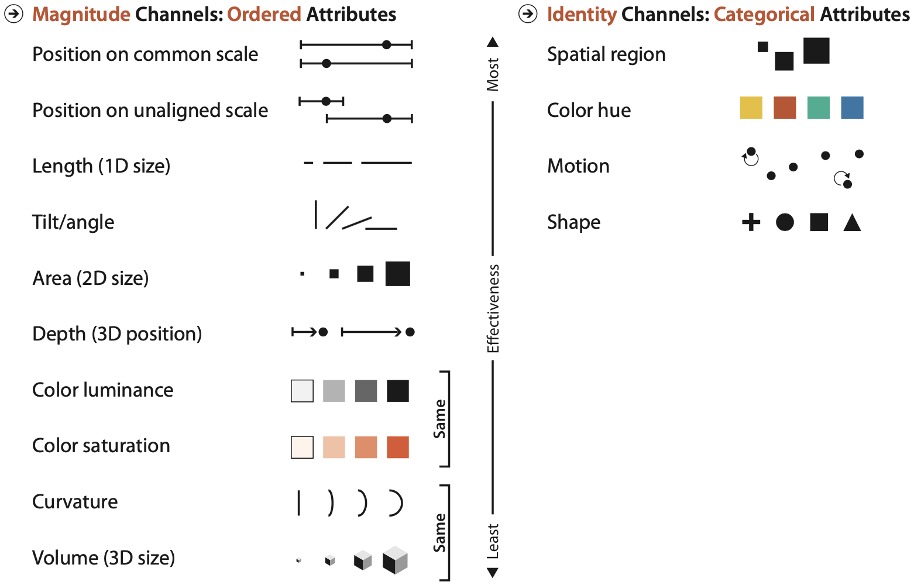
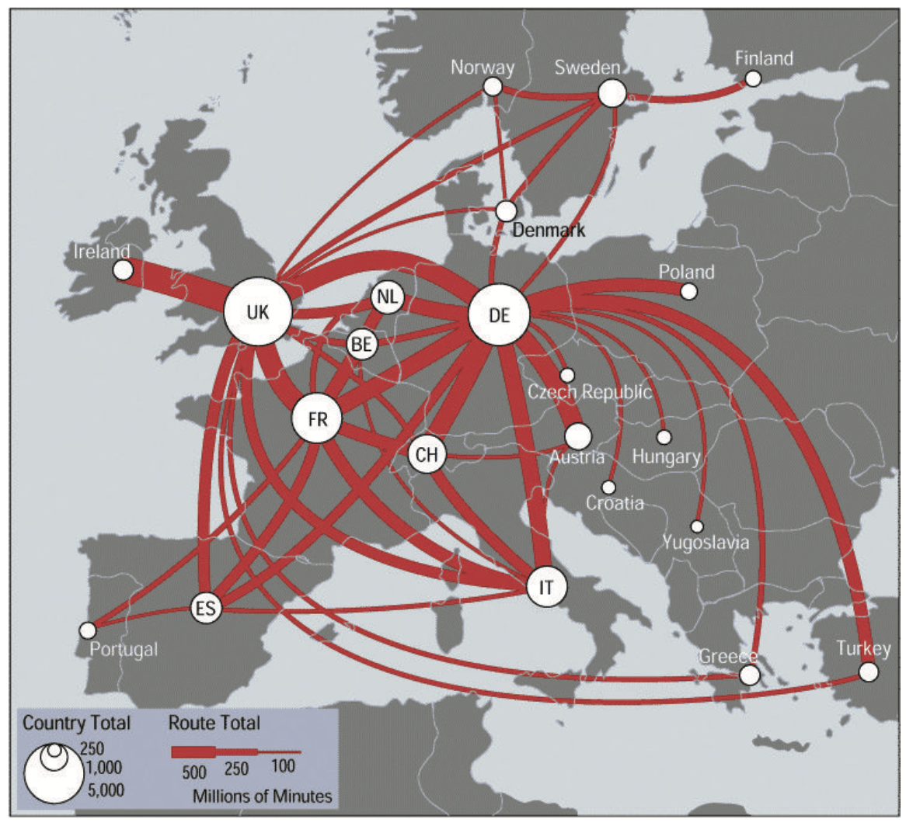
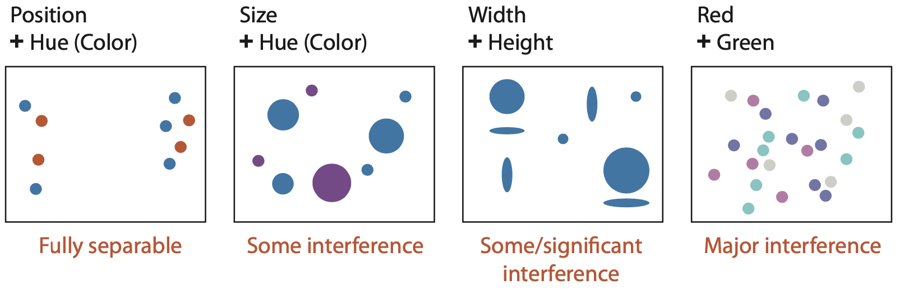
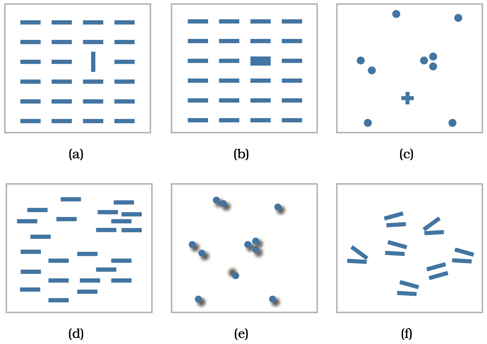
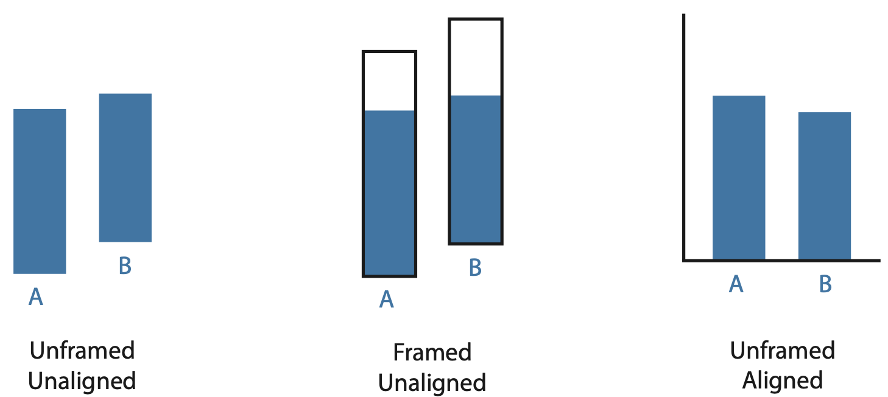
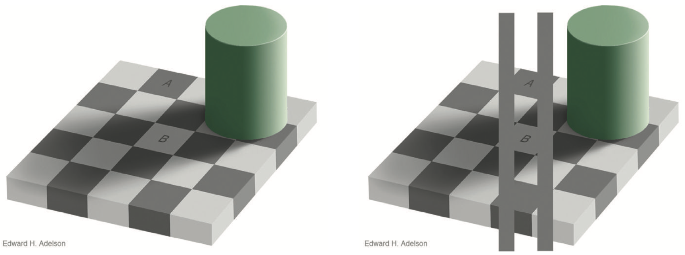
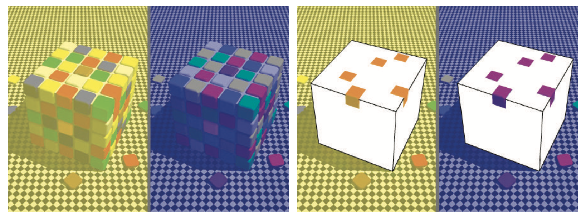

<!-- <style type="text/css"> -->
<!-- slides > slide:not(.nobackground):after { -->
<!--   content: '';` -->
<!-- } -->
<!-- </style> -->

```{r setup, include=FALSE}
library(dplyr)
library(here)
library(knitr)
library(ggplot2)
library(ggrepel)
library(lubridate)
library(patchwork)
library(readr)
library(scales)

theme_set(theme_bw())
knitr::opts_chunk$set(echo = FALSE, message = FALSE, warning = FALSE)
```

<style>
div.footnotes {
  position: absolute;
  bottom: 0;
  margin-bottom: 10px;
  width: 80%;
  font-size: 0.6em;
}
</style>

## Marcas e canais visuais {.smaller}

**Marcas**: elementos geométricos que representam itens ou links

<div class="columns-2">
<span class="blue">Marcas para itens / nodes:</span>

- **Pontos**: marca zero dimensão (_0D_)
  - ex: localização, quantidade
- **Linhas**: marca uma dimensão (_1D_)
  - ex: quantidade, rota, limite
- **Áreas**: marca com duas dimensões (_2D_)
  - ex: quantidade, proporção

<span class="blue">Marcas para links:</span>

- **Conexão**: mostra o relacionamento entre dois itens usando uma linha
- **Contenção**: mostra relações de hierarquia usando áreas

```{r, out.width="500px"}

```
</div>

<div class="footnotes">Fonte:  Tamara Munzner. [**Visualization Analysis & Design**](https://www.cs.ubc.ca/~tmm/vadbook/).</div>

## Marcas e canais visuais {.smaller}

**Canais**: forma de cotrolar aparência das marcas

<span class="blue">Canais básicos:</span>

<div class="columns-2">

- **Posição**
  - horizontal, vertical, ambas
- **Cor**
  - matiz (_hue_), brilho (_luminosity_), saturação (_saturation_)
- **Forma**
- **Inclinação (ângulo)**
- **Tamanho**
  - comprimento, área, volume
- **Movimento**

<br/><br/><br/>

```{r, fig.align="center"}

```
</div>

<div class="footnotes">Fonte:  Tamara Munzner. [**Visualization Analysis & Design**](https://www.cs.ubc.ca/~tmm/vadbook/).</div>

## Marcas, canais e codificação de atributos? (1) {.build .smaller}

```{r, out.width='600px', fig.align='center'}
covid_br <- read_csv(here("data", "covid-br-ms-country.csv"), col_types = cols())

ggplot(filter(covid_br, data >= ymd("2020-06-01")), aes(data, casosNovos)) +
  geom_col()
```

- Gráfico de barras (_bar plot_) codifica dois atributos usando a marca **linha**
  - _casos novos_ (quantitativo): canal **tamanho**
  - _data_ (ordinal): canal **posição horizontal**
  

## Marcas, canais e codificação de atributos? (2) {.build .smaller}

```{r, fig.width=6, fig.height=3.5, fig.align='center'}
covid_estados <- read_csv(here("data", "covid-br-ms-states.csv"),
                          col_types = cols(populacaoTCU2019 = col_integer())) 

covid_regioes <- covid_estados %>%
  group_by(regiao, data, semanaEpi) %>%
  summarise_at(vars(populacaoTCU2019:obitosNovos), sum)
  
ggplot(filter(covid_estados, data == max(data)),
              aes(casosAcumulado, obitosAcumulado)) +
  geom_point(alpha = 0.6, size = 3) +
  labs(title = "Casos e óbitos confirmados nos estados, em escala log",
       x = "Casos confirmados", y = "Óbitos confirmados", col = "região") +
  scale_x_log10(breaks = trans_breaks("log10", function(x) 10^x),
                labels = trans_format("log10", math_format(10^.x))) +
  scale_y_log10(breaks = trans_breaks("log10", function(x) 10^x),
                labels = trans_format("log10", math_format(10^.x)))
```

- Gráfico de dispersão (_scatter plot_) que codifica dois atributos usando a marca **ponto**
  - _casos novos_ (quantitativo): canal **posição horizontal**
  - _óbitos novos_ (quantitativo): canal **posição vertical**
  

## Marcas, canais e codificação de atributos? (3) {.smaller}

```{r, fig.width=7.35, fig.height=3.5}
ggplot(filter(covid_estados, data == max(data)),
              aes(casosAcumulado, obitosAcumulado, col = regiao)) +
  geom_point(size = 3, alpha = 0.6) +
  labs(title = "Casos e óbitos confirmados nos estados, em escala log",
       x = "Casos confirmados", y = "Óbitos confirmados", col = "região") +
  scale_color_brewer(type = "qual", palette = 2) +
  scale_x_log10(breaks = trans_breaks("log10", function(x) 10^x),
                labels = trans_format("log10", math_format(10^.x))) +
  scale_y_log10(breaks = trans_breaks("log10", function(x) 10^x),
                labels = trans_format("log10", math_format(10^.x)))
```

> - Gráfico de dispersão (_scatter plot_) que codifica dois atributos usando a marca **ponto**
>     - _casos novos_ (quantitativo): canal **posição horizontal**
>     - _óbitos novos_ (quantitativo): canal **posição vertical**
>     - <span class="red">_região_ (categórico): canal **cor**</span>


## Marcas, canais e codificação de atributos? (4) {.smaller}

```{r, fig.width=7.7, fig.height=3.5}
ggplot(filter(covid_estados, data == max(data)),
              aes(casosAcumulado, obitosAcumulado, col = regiao,
                  size = populacaoTCU2019/10^6)) +
  geom_point(alpha = 0.6) +
  labs(title = "Casos e óbitos confirmados nos estados, em escala log",
       x = "Casos confirmados", y = "Óbitos confirmados", col = "região",
       size = "população (milhões)") +
  scale_color_brewer(type = "qual", palette = 2) +
  scale_x_log10(breaks = trans_breaks("log10", function(x) 10^x),
                labels = trans_format("log10", math_format(10^.x))) +
  scale_y_log10(breaks = trans_breaks("log10", function(x) 10^x),
                labels = trans_format("log10", math_format(10^.x)))
```

> - Gráfico de dispersão (_scatter plot_) que codifica dois atributos usando a marca **ponto**
>     - _casos novos_ (quantitativo): canal **posição horizontal**
>     - _óbitos novos_ (quantitativo): canal **posição vertical**
>     - _região_ (categórico): canal **cor**
>     - <span class="red">_população_ (quantitativo): canal **tamanho** -- área do círculo</span>


## Marcas, canais e codificação de atributos? (5) {.smaller}

<span style="margin:0px 150px 0px;font-size:14pt;font-weight:bold">Transmissões de COVID-19 entre continentes</span>
```{r, out.width='700px', fig.align='center'}
include_graphics("images/covid_transmissions_map.png")
```

> - Mapa que usa a marca **ponto** para casos e **conexão** para transmissões entre continentes
>     - _continente_ (categórico): canal **cor** e canal **posição** -- horizontal (latitude) e vertical (longitude)
>     - _casos_ (quantitativo): canal **tamanho** -- área do círculo
>     - _transmissões_ (quantitativo): canal **tamanho** -- área (largura) da linha

<div class="footnotes">Fonte:  Tamara Munzner. [**Visualization Analysis & Design**](https://www.cs.ubc.ca/~tmm/vadbook/).</div>

## Tipos de canais

- Canais de **identidade**: dá informações sobre _o que_ ou _onde_ algo está
  - São são mais adequados para atributos categóricos
  - Ex: forma, matiz da cor (_hue_), movimento

<br/>

- Canais de **magnitude**: dá informações sobre _quanto_ se tem de algo
  - São mais adequados para atributos ordenados
  - Ex: tamanho, brilho da cor (_luminance_), saturação da cor (_saturation_), inclinação


## Princípios de uso de canais visuais

- **Expressividade**: codificação deve expressar toda informação dos atributos, mas apenas isso
  - A ordem dos atributos ordenados deve ser perceptível
  - Exemplo para canal de magnitude:
  
  
```{r, fig.width=10, fig.height=3, fig.align='center'}
p1 <- ggplot(filter(covid_estados, data == max(data)),
             aes(casosAcumulado, obitosAcumulado,
                 shape = cut(populacaoTCU2019/10^6, breaks = seq(0, 50, 10)))) +
  geom_point(size = 3, alpha = 0.6) +
  labs(title = "ruim",
       x = "Casos confirmados", y = "Óbitos confirmados",
       shape = "população (milhões)") +
  scale_color_hue() +
  scale_x_log10(breaks = trans_breaks("log10", function(x) 10^x),
                labels = trans_format("log10", math_format(10^.x))) +
  scale_y_log10(breaks = trans_breaks("log10", function(x) 10^x),
                labels = trans_format("log10", math_format(10^.x))) +
  theme(plot.title = element_text(color = "red"))

p2 <- ggplot(filter(covid_estados, data == max(data)),
             aes(casosAcumulado, obitosAcumulado, #col = factor(round(populacaoTCU2019/10^6)))) +
                 size = populacaoTCU2019/10^6)) +
  geom_point(alpha = 0.6) +
  labs(title = "bom",
       x = "Casos confirmados", y = "Óbitos confirmados", size = "população (milhões)") +
  scale_color_hue() +
  scale_x_log10(breaks = trans_breaks("log10", function(x) 10^x),
                labels = trans_format("log10", math_format(10^.x))) +
  scale_y_log10(breaks = trans_breaks("log10", function(x) 10^x),
                labels = trans_format("log10", math_format(10^.x))) +
  theme(plot.title = element_text(color = "blue"))

p1 + p2
```

## Princípios de uso de canais visuais

- **Expressividade**: codificação deve expressar toda informação dos atributos, mas apenas isso
  - Atributos categóricos não devem ser percebidos com ordem inexistente
  - Exemplo para canal de identidade:
  
```{r, fig.width=10, fig.height=3, fig.align='center'}
p1 <- ggplot(filter(covid_estados, data == max(data)),
             aes(casosAcumulado, obitosAcumulado, col = regiao)) +
  geom_point(size = 3, alpha = 0.6) +
  labs(title = "ruim",
       x = "Casos confirmados", y = "Óbitos confirmados", col = "região") +
  scale_color_brewer(type = "seq", palette = 2) +
  scale_x_log10(breaks = trans_breaks("log10", function(x) 10^x),
                labels = trans_format("log10", math_format(10^.x))) +
  scale_y_log10(breaks = trans_breaks("log10", function(x) 10^x),
                labels = trans_format("log10", math_format(10^.x))) +
  theme(plot.title = element_text(color = "red"))

p2 <- ggplot(filter(covid_estados, data == max(data)),
             aes(casosAcumulado, obitosAcumulado, col = regiao)) +
  geom_point(size = 3, alpha = 0.6) +
  labs(title = "bom",
       x = "Casos confirmados", y = "Óbitos confirmados", col = "região") +
  scale_color_brewer(type = "qual", palette = 2) +
  scale_x_log10(breaks = trans_breaks("log10", function(x) 10^x),
                labels = trans_format("log10", math_format(10^.x))) +
  scale_y_log10(breaks = trans_breaks("log10", function(x) 10^x),
                labels = trans_format("log10", math_format(10^.x))) +
  theme(plot.title = element_text(color = "blue"))

p1 + p2
```

## Princípios de uso de canais visuais

- **Efetividade**: atributos mais importantes codificados com canais mais efetivos

```{r, fig.align='center'}

```


## Efetividade de canais visuais - Exemplo (1) {.smaller}

```{r, fig.width=7.35, fig.height=3.5, fig.align='center'}
ggplot(filter(covid_estados, data == max(data)),
              aes(casosAcumulado, obitosAcumulado, alpha = regiao)) +
  geom_point(size = 3) +
  labs(title = "Casos e óbitos confirmados nos estados, em escala log",
       x = "Casos confirmados", y = "Óbitos confirmados", col = "região") +
  scale_shape(solid = TRUE) +
  scale_x_log10(breaks = trans_breaks("log10", function(x) 10^x),
                labels = trans_format("log10", math_format(10^.x))) +
  scale_y_log10(breaks = trans_breaks("log10", function(x) 10^x),
                labels = trans_format("log10", math_format(10^.x)))
```

> - The bad


## Efetividade de canais visuais - Exemplo (2) {.smaller}

```{r, fig.width=7.35, fig.height=3.5, fig.align='center'}
ggplot(filter(covid_estados, data == max(data)),
              aes(casosAcumulado, obitosAcumulado, shape = regiao)) +
  geom_point(alpha = 0.6, size = 3) +
  labs(x = "Casos confirmados", y = "Óbitos confirmados", col = "região") +
  scale_shape(solid = TRUE) +
  scale_x_log10(breaks = trans_breaks("log10", function(x) 10^x),
                labels = trans_format("log10", math_format(10^.x))) +
  scale_y_log10(breaks = trans_breaks("log10", function(x) 10^x),
                labels = trans_format("log10", math_format(10^.x)))
```

> - The ugly


## Efetividade de canais visuais - Exemplo (3) {.smaller}

```{r, fig.width=7.35, fig.height=3.5, fig.align='center'}
ggplot(filter(covid_estados, data == max(data)),
              aes(casosAcumulado, obitosAcumulado, col = regiao)) +
  geom_point(alpha = 0.6, size = 3) +
  labs(title = "Casos e óbitos confirmados nos estados, em escala log",
       x = "Casos confirmados", y = "Óbitos confirmados", col = "região") +
  scale_shape(solid = TRUE) +
  scale_x_log10(breaks = trans_breaks("log10", function(x) 10^x),
                labels = trans_format("log10", math_format(10^.x))) +
  scale_y_log10(breaks = trans_breaks("log10", function(x) 10^x),
                labels = trans_format("log10", math_format(10^.x)))
```

> - The good

## Efetividade de canais visuais - Exemplo (4) {.smaller}

```{r, fig.width=10, fig.height=4, fig.align='center'}
ggplot(filter(covid_estados, data == max(data)),
              aes(casosAcumulado, obitosAcumulado, col = regiao)) +
  geom_point(aes(size = populacaoTCU2019/10^6), alpha = 0.5) +
  geom_text_repel(aes(label = estado), show.legend = FALSE) +
  labs(title = "Casos e óbitos confirmados nos estados, em escala log",
       x = "Casos confirmados", y = "Óbitos confirmados",
       size = "população (milhões)") +
  scale_shape(solid = TRUE) +
  facet_wrap(~ regiao, nrow = 1) +
  scale_x_log10(breaks = trans_breaks("log10", function(x) 10^x),
                labels = trans_format("log10", math_format(10^.x))) +
  scale_y_log10(breaks = trans_breaks("log10", function(x) 10^x),
                labels = trans_format("log10", math_format(10^.x))) +
  scale_size(range = c(2, 7)) +
  guides(colour = "none") +
  theme(legend.position = "bottom")
```

- The better?


## Critérios de efetividade do canal (1)

- **Acurácia**: quão próxima a percepção está do objetivo de um estímulo?

## Critérios de efetividade do canal (2)

- **Discriminabilidade**: diferenças entre itens são perceptíveis como desejado?

```{r, fig.align='center', out.height="500px"}

```


## Critérios de efetividade do canal (3)

- **Separabilidade**: canais separáveis para identificar atributos diferentes, ou canais integrais para identificar diferentes categorias de um único atributo

```{r, fig.align='center'}

```

<div class="footnotes">Fonte:  Tamara Munzner. [**Visualization Analysis & Design**](https://www.cs.ubc.ca/~tmm/vadbook/).</div>

## Critérios de efetividade do canal (4)

- **Popout**: um item distinto se destaca dos outros imediatamente
  - Ex: onde está a Paraíba? (item distinto)

```{r, fig.width=10, fig.height=3, fig.align='center'}
p1 <- covid_estados %>%
  filter(data == max(data)) %>%
ggplot(aes(casosAcumulado, obitosAcumulado, col = estado == "PB")) +
  geom_point(alpha = 0.7, size = 3) +
  labs(x = "População (milhões)", y = "Casos confirmados", col = "região") +
  scale_color_manual(values = c("black", "red")) +
  scale_x_log10(breaks = trans_breaks("log10", function(x) 10^x),
                labels = trans_format("log10", math_format(10^.x))) +
  scale_y_log10(breaks = trans_breaks("log10", function(x) 10^x),
                labels = trans_format("log10", math_format(10^.x))) +
  theme(legend.position = "none")

p2 <- covid_estados %>%
  filter(data == max(data)) %>%
ggplot(aes(casosAcumulado, obitosAcumulado, shape = estado == "PB")) +
  geom_point(alpha = 0.7, size = 3, col = "red") +
  labs(x = "População (milhões)", y = "Casos confirmados", col = "região") +
  scale_shape_manual(values = c(15, 16)) +
  scale_x_log10(breaks = trans_breaks("log10", function(x) 10^x),
                labels = trans_format("log10", math_format(10^.x))) +
  scale_y_log10(breaks = trans_breaks("log10", function(x) 10^x),
                labels = trans_format("log10", math_format(10^.x))) +
  theme(legend.position = "none")

p3 <- covid_estados %>%
  filter(data == max(data)) %>%
ggplot(aes(casosAcumulado, obitosAcumulado, shape = estado == "PB",
           col = regiao == "Nordeste")) +
  geom_point(alpha = 0.7, size = 3) +
  labs(x = "População (milhões)", y = "Casos confirmados", col = "região") +
  scale_color_manual(values = c("black", "red")) +
  scale_shape_manual(values = c(15, 16)) +
  scale_x_log10(breaks = trans_breaks("log10", function(x) 10^x),
                labels = trans_format("log10", math_format(10^.x))) +
  scale_y_log10(breaks = trans_breaks("log10", function(x) 10^x),
                labels = trans_format("log10", math_format(10^.x))) +
  theme(legend.position = "none")

(p1 | p2 | p3)

```

## Critérios de efetividade do canal (4)

- **Popout**: um item distinto se destaca dos outros imediatamente
  - Exemplos em outros canais

```{r, fig.align='center', out.height="450px"}

```


## Critérios de efetividade do canal (5)

- **Agrupamento**: grupos podem ser percebidos com: 
  - Marcas de links, como áreas de contenção ou linhas de conexão
  - Canais de identidade
  - Canais de proximidade, posicionando itens na mesma região espacial
  - Canais de similaridade em outros canais, como cor, movimento ou até forma


## Julgamento relativo vs. absoluto

- O sistema de percepção humano é baseado em julgamentos relativos
  - Ex: nós percebemos a diferença **percentual** de tamanhos de objetos
  
```{r, fig.align='center'}

```

<div class="footnotes">Fonte:  Tamara Munzner. [**Visualization Analysis & Design**](https://www.cs.ubc.ca/~tmm/vadbook/).</div>

## Julgamento relativo vs. absoluto

- O sistema de percepção humano é baseado em julgamentos relativos
  - Ex: a percepção de luminosidade é contextual
  
```{r, fig.align='center'}

```

## Julgamento relativo vs. absoluto

- O sistema de percepção humano é baseado em julgamentos relativos
  - Ex: a percepção de cor é contextual
  
```{r, fig.align='center'}

```

<div class="footnotes">Fonte:  Tamara Munzner. [**Visualization Analysis & Design**](https://www.cs.ubc.ca/~tmm/vadbook/).</div>

- Nosso sistema visual evoluiu para prover **constância de cores**, onde a mesma superfície é identificada em diversas condições de luminosidade
  - Funciona em ambientes naturais, mas pode enganar ao codificar com cor
  
## Referências

## Referências

- Tamara Munzner. [**Visualization Analysis & Design**](https://www.cs.ubc.ca/~tmm/vadbook/). Ch 5 - Marks and channels. CRC Press, 2014.